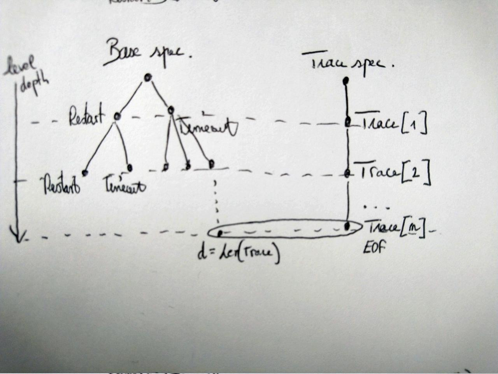
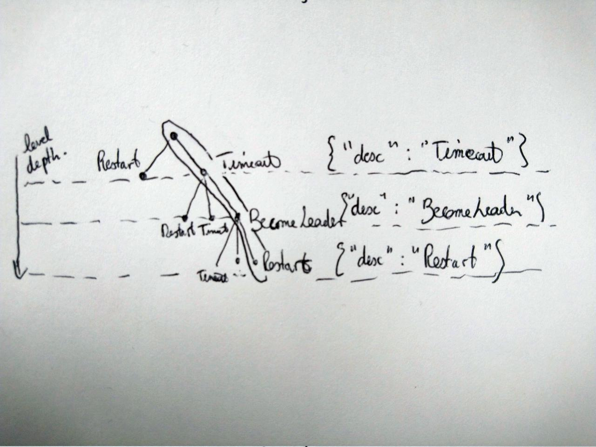

# Work progress

Development of:

- A generic specification template for trace validation (*trace spec*)
- A library (*instrumentation*) for logging events and variable updates
- A “method” based on the above for validating traces of implementations

Applied to three case studies:

- Two-phase protocol (distributed)
- Key-value store
- Raft (distributed)

# Raft example - spec

The base specification (Raft):

```
\* Defines the system transitions
Next == /\ \/ \E i \in Server : Restart(i)
           \/ \E i \in Server : Timeout(i)
           \/ \E i \in Server : BecomeLeader(i)
...
...

Spec == Init /\ [][Next]_vars
```

# Raft example - trace

 - A trace records a behavior of a system
 - A trace is a sequence of events (corresponding to TLA+ actions)
 - Each event may contain several variable updates
 - Extract of a trace of Raft:

```json
{
    "clock": 1, 
    "state": [ {"op": "Replace", 
                "path": ["node2"], 
                "args": ["Candidate"]}  ], 
    "desc": "Timeout"
}
...
{
    "clock": 26, 
    "state": [ {"op": "Replace", 
                "path": ["node1"], 
                "args": ["Leader"]}  ], 
    "desc": "BecomeLeader"
}
```


# Trace specification - how do we validate a trace ?



# Trace specification - how do we validate a trace ?

 - The trace must correspond to at least one path through the state space graph
 - Expressed for TLC as a `POSTCONDITION`
 - Exploit non-determinism of TLA+ specifications

```
TraceAccepted ==
    (* Diameter equal to trace length => *)
    (* Trace file has been read completely at least one time *)
    LET d == TLCGet("stats").diameter IN
    IF d - 1 = Len(Trace) THEN TRUE
    ELSE Print(<<"Failed matching the trace to (a prefix of
    "TLA+ debugger breakpoint hit count " \

POSTCONDITION
    TraceAccepted
```

# Ensure that the trace specification refines the base spec

```
(* Temporal formula for trace spec *)
TraceSpec == TraceInit /\ [][TraceNext]_<<l, vars>>

(* Instantiate raft *)
BASE == INSTANCE raft
BaseSpec == BASE!Init /\ [][BASE!Next \/ ComposedNext]_BASE!vars
```

```
SPECIFICATION
    TraceSpec
PROPERTIES
    (* Refine raft *)
    BaseSpec
```

# Trace specification - read trace events

 - Read trace one line at a time (each line is an event)
 - Update variables according to information provided by events

```
logline == Trace[l]

ReadNext ==
    (* depth: line number *)
    /\ l' = l + 1
    (* Apply all variable updates *)
    /\ MapVariables(logline)
    (* Advance base spec *)
    /\ BASE!Next
```

# Trace specification - updating variables

```
MapVariables(logline) ==
    /\
        IF "state" \in DOMAIN logline
        THEN state' = ExceptAtPaths(state, logline.state)
        ELSE TRUE
    /\
        IF "currentTerm" ...
```

If a variable change isn’t logged, `TraceSpec` just lets TLC search for all possible values of this variable according to base spec.


# Trace specification - updating variables

 - Generic operators for updating variables

```
Replace(cur, val) == val
AddElement(cur, val) == cur \cup {val}
AddElements(cur, vals) == cur \cup vals
RemoveElement(cur, val) == cur \ {val}
Clear(cur, val) == {}
...
```

# Trace specification - updating variables

 - A way for updating records partially
 - By applying any operator to any member of record

Recursive function below, allow TLC to access and modify a member of a record:

```
RECURSIVE ExceptAtPath(_,_,_,_,_)
LOCAL ExceptAtPath(var, default, path, op, args) ==
    LET h == Head(path) IN
    IF Len(path) > 1 THEN
        [var EXCEPT ![h] = 
          ExceptAtPath(var[h], default[h], Tail(path), op, args)]
    ELSE
        [var EXCEPT ![h] = Apply(@, default[h], op, args)]
```

# Trace specification - updating variables

The event

```json
{
    "clock": 1,
    "state": [ {"op": "Replace", 
                "path": ["node2"],
                "args": ["Candidate"]}  ],
    "desc": "Timeout"
}
```

should map the variable `state` as follows:

```
state' = ExceptAtPaths(state, logline.state)
<=> 
state' = [state EXCEPT !["node2"] = Replace(@, "Candidate")] 
<=> 
state' = [state EXCEPT !["node2"] = "Candidate"]
```


# Trace specification - updating variables

 - A variable can be updated partially at a given path

```json
{"matchIndex": [ {"op": "Replace",
                  "path": ["node3", "node2"],
                  "args": [7]}]}
```

 - This update will be automatically translated to:
```
   matchIndex' = [matchIndex EXCEPT !["node3"]["node2"] = 7]
```

# Trace specification - updating variables

 - Many operators can be applied in one atomic action
 - Operators are applied to variable sequentially


```json
{
    "clock": 1,
    "mySet": [ 
            {"op": "AddElement", 
             "path": [],
             "args": [4]} ,
            {"op": "AddElement", 
             "path": [],
             "args": [5]}
             ]
    ...
}
```
```

==> 

  mySet' = AddElement(AddElement(mySet, 4), 5)
```

# Trace specification - optimization

 - In order to reduce the state space, the trace may indicate the name of the action to be applied.
 - Specifying action name when logging is not mandatory.



# Trace specification - optimization

 - For each action contained in base spec we write a corresponding predicate
 - Predicate enable TLC to select next expected action when `IsEvent` is `TRUE`

```
IsEvent(e) ==
    /\ IF "desc" \in DOMAIN logline
       THEN logline.desc = e ELSE TRUE

IsRestart ==
    /\ IsEvent("Restart")
    /\ \E i \in Server : Restart(i)

IsTimeout ==
    /\ IsEvent("Timeout")
    /\ \E i \in Server : Timeout(i)
...
```

# Trace specification - optimization

 - next action of trace spec is just the disjunction of all predicates

```
TraceNext ==
    \/ IsRestart
    \/ IsTimeout
    ...
```

# Instrumentation - How to log

Purpose:

  * Generate a trace by logging some events
  * Log variable changes and potentially the event name 

Method

1. We have to log all events that correspond to actions of the base spec: TLC will not fill "holes".
2. Logging all variable updates is not necessary, but the more variables we log,
the smaller is the state space explored by TLC, and the more confident we are in the implementation

# Instrumentation - logging variables

The idea is to log variable updates whenever a variable corresponding to a specification variable is modified.

Declare spec variable:

```java
this.spec = new TraceInstrumentation(nodeInfo.name()
                                     + ".ndjson", clock);
// Binding to variable state at path nodeName (state[nodeName ])
this.specState = spec.getVariable("state")
                     .getField(nodeInfo.name());
this.specVotesGranted = spec.getVariable("votesGranted")
                     .getField(nodeInfo.name());
```

# Instrumentation - logging variables

Log variable changes:

```java
private void setState(NodeState state) {
    this.state = state;
    // log
    specState.set(state.toString());
    // ALT: this.spec.notify(specState, SET, state.toString());
}
...
if (m.isGranted()) {
    // Add node that granted a vote to me
    candidateState.getGranted().add(m.getFrom());
    // log
    specVotesGranted.add(m.getFrom());
}
```

# Instrumentation - log events

- When we consider an action as complete, we can commit changes
    * Collect all previously logged variable updates and add one event in trace

Example of log “Timeout” event in Raft:

```java
public void timeout() {
    assert state == NodeState.Follower;
    ...
    // state goes to candidate
    state = NodeState.Candidate;
    // log variables
    specState.set(state.toString());
    ...
    // commit
    spec.commitChanges("Timeout");
}
```
# Instrumentation - log events

Will produce one event:

```json
{
    "clock": 15, 
    "state": [ {"op": "Replace", 
                "path": ["node1"], 
                "args": ["Candidate"]} ], 
    "desc": "Timeout"
}
```

# Instrumentation - clocks

Two ways of synchronizing clock between distributed processes are supported:

 - Lamport clock: clocks are sent in messages and we explicitly call
the sync method of logging framework
 - Shared clock, if all processes are executed on the same physical
machine, they can share a clock in a memory mapped file: `SharedClock.get(clockName);`


# Execution pipeline

Tests are run as a script execution pipeline:

- Execute implementation (this creates a trace file by logging
events and variable updates)
- Merge trace files that were produced by different processes
- Execute TLC on the trace spec for a given trace file

# Results: bugs found

  - KeyValueStore: forgotten conditions / guards (3 cases)
  - Raft: strict instead of non-strict inequalities
  - Instrumentation: forgotten thread synchronisation

 - Bugs can be identified very quickly:
    - Use of `desc` field gives information about the action that failed
    - Retrieve line number where validation fails and use TLA+ debugger

# Results: benefits and limits

 - Find bugs in new implementations: events adhere to the specification
 - Avoid regressions when implementation changes

 - Need to know the specification
    - Especially all the actions (to be able to log all events)
    - The structure of variables (to be able to update them partially)

